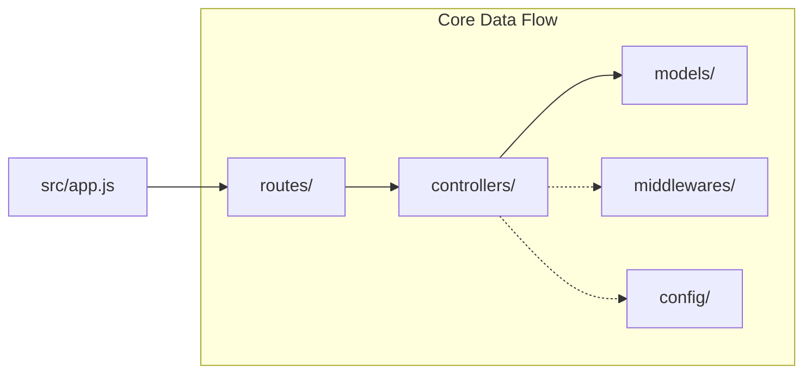

# Pixora - Backend Server API ⚙️

The Backend for Pixora is a robust Node.js/Express.js REST API. It serves the monolithic MERN architecture by handling strict database schema relationships, query optimization, route protection, and edge case error handling.

## 📂 Folder Structure & Workflow

### Directory Breakdown
- **/src/app.js**: The central gateway. Contains the global Express error handlers, CORS configuration, and acts as the entry point serving the React `dist/` interface.
- **/src/routes**: Maps URL endpoints (e.g., `/api/posts`, `/api/auth`) to their specific controller functions.
- **/src/controllers**: Houses the raw business logic. This is where users are created, feeds are processed, and image uploads are parsed.
- **/src/models**: Contains the Mongoose ODM schemas. Utilizes strict DB-level Edge Collections via `mongoose.Schema.Types.ObjectId` (rather than strings) to preserve data integrity between Users, Likes, Follows, and Posts.
- **/src/middlewares**: Defines interceptor functions. Most notably `identifyUser` (enforcing strict login) and `optionalIdentifyUser` (checking token without denying public read access).

## 🚀 Advanced Backend Techniques

1. **O(1) Data Structuring / N+1 Avoidance**
   - The feed retrieves thousands of posts. Instead of mapping database calls `findById` per post (N+1 query bottlenecks), we pull all posts, extract an array of IDs into a unique map, and execute a single `$in: [postIds]` to get like metrics. Finally, a Javascript `Set` is used in-memory for instant truth checks.
2. **Global Error Catching System**
   - Instead of breaking server connections, a fail-safe module rests at the base of `app.js` using `(err, req, res, next)`, converting all rogue backend throws into standard JSON `{ message: ... }` payloads.
3. **Public API vs Private Access Control**
   - Route strategies utilize a hybridized token-checking technique where the homepage is fully viewable globally, but interacting with database collections explicitly requires strict JSON Web Tokens (JWT).

## 🌐 Endpoints Overview (Samples)
- `POST /api/auth/login` - Authenticates user & issues HttpOnly Cookie.
- `GET /api/posts/feed` - Fetches global feed.
- `PUT /api/posts/like/:id` - Edge collection mutation (Protected).
