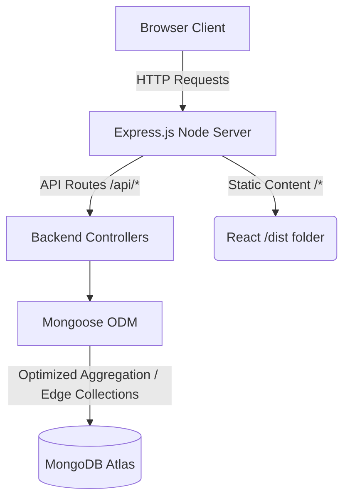

# Pixora - Modern MERN Stack Social Media App


**Pixora** (formerly Socialify) is a highly optimized, fully featured social media platform built using the MERN stack (MongoDB, Express, React, Node.js). It demonstrates modern architectural principles, zero-latency optimistic UI updates, and monolithic production deployments.

---

## 🏗️ Global Architecture Flow

The project is natively divided into two main environments during development, which are compiled into a monolithic architecture for seamless deployment.



---

## 🚀 Key Technical Highlights

1. **Monolithic Deployment Architecture**
   - The React frontend compiles directly into the Backend's `dist` folder. The Node/Express server acts as both the static file server (for the React views) and the JSON API responder. You only have to deploy the `Backend` directory, significantly reducing hosting costs.
2. **N+1 Query Optimization**
   - Implemented high-performance `$in` Array queries and fast in-memory Maps/Sets on the backend to attach relational data (like checking if the logged-in user likes a post) in `O(1)` time complexity. This completely eradicated severe N+1 loop freezing in the feed.
3. **Optimistic UI State (Zero-Latency Transitions)**
   - When users like or unlike a post, the UI instantly reacts (0ms latency), and the network request executes silently in the background. If the request fails, the UI effortlessly reverts.
4. **Edge Collections (Relational DB Design)**
   - Strict `ObjectId` relationships between Posts, Users, Likes, and Follows—ensuring data integrity is never broken across the platform.
5. **4-Layer Frontend Architecture**
   - The React codebase is hyper-scalable, adhering strictly to a Feature-Driven design separated into UI (Components/Pages), State Logic (Context/Hooks), and Network Logic (Services).

## 🛠 Setup & Clone Instructions

### 1. Clone the Repository
```bash
git clone <your-github-repo-url>
cd socialify
```

### 2. Setup the Backend
The backend serves as the core of the deployed app.
```bash
cd Backend
npm install

# Create a .env file based on the environment guidelines
echo "MONGO_URI=your_mongo_url" >> .env
echo "JWT_SECRET=your_secret_key" >> .env
echo "IMAGEKIT_PRIVATE_KEY=your_imagekit_key" >> .env
```

### 3. Setup the Frontend (Development Only)
The frontend uses Vite and dynamically proxies `/api` calls to the backend on `localhost:3000`.
```bash
cd ../Frontend
npm install
```

### 4. Running Locally
Using two terminals, start the full-stack development environment:

**Terminal 1 (Backend - API server on port 3000)**
```bash
cd Backend
npm run dev
```

**Terminal 2 (Frontend - Vite dev server on port 5173)**
```bash
cd Frontend
npm run dev
```

### 5. Production Build
When you are ready to deploy to Render, Heroku, or AWS:
```bash
cd Frontend
npm run build 

# The build will automatically deposit itself into Backend/dist.
# Then, simply push the Backend folder safely to your Cloud Provider!
```

---

**Directory Readmes:**
- [Frontend Documentation](./Frontend/README.md)
- [Backend Documentation](./Backend/README.md)
